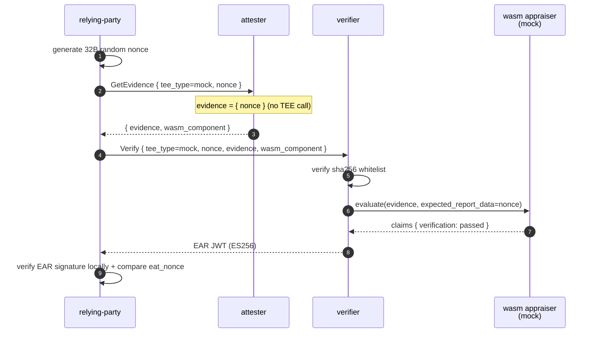
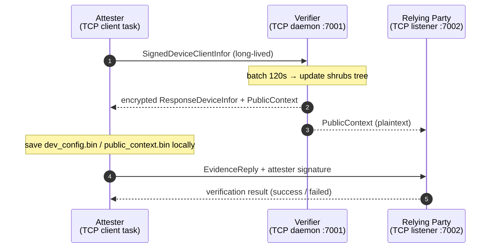
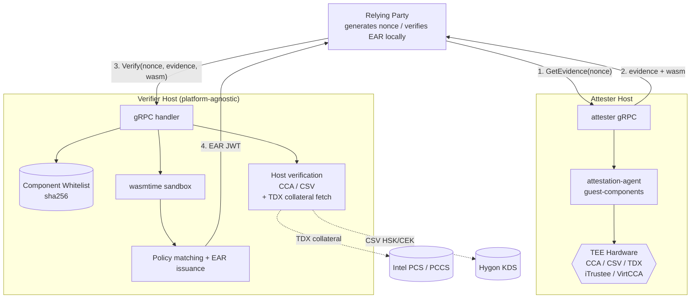
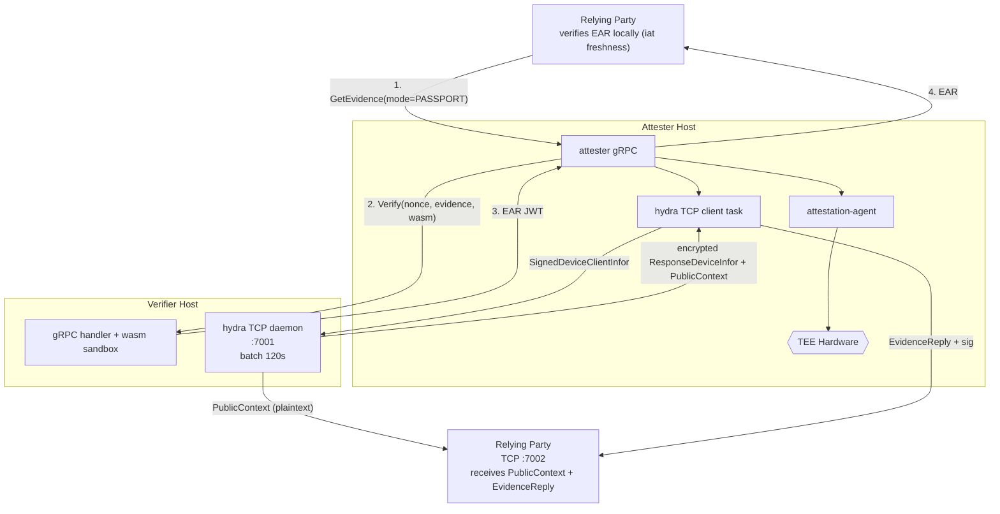

# unified-attestation

> A self-verifying remote attestation implementation using wasm verification components + Groth16 zero-knowledge proofs, decoupling the verifier from TEE platforms.

unified-attestation solves the coupling problem in remote attestation where "the verifier must embed platform-specific code for each TEE." Platform-specific evidence verification logic is encapsulated into wasm components and uploaded by the attester alongside evidence. The verifier only performs sha256 whitelist validation, wasmtime sandbox invocation, policy comparison, and EAR issuance. TEE platform upgrades only require replacing the component and updating the whitelist — the verifier binary needs no re-release.

Supports six TEE platform paths: mock / CCA / CSV / TDX / iTrustee / VirtCCA, with five hydra zero-knowledge proof stacking paths (cca-hydra / csv-hydra / tdx-hydra / itrustee-hydra / virtcca-hydra) for a total of 11 tee_type values. The hydra layer proves device identity within a whitelist without revealing the specific index.

## Table of Contents

- [Background](#background)
- [Install](#install)
- [Usage](#usage)
  - [Mock mode (no TEE dependency)](#mock-mode-no-tee-dependency)
  - [TEE paths](#tee-paths)
  - [Hydra paths](#hydra-paths)
- [API](#api)
- [Architecture](#architecture)
- [Project Structure](#project-structure)

## Background

Four core mechanisms (detailed discussion in [docs/en/design.md](docs/en/design.md)):

- **Verifier decoupled from TEE platforms**: Each TEE's evidence verification logic is encapsulated into a wasm component. Platform upgrades only require component replacement + sha256 whitelist updates.
- **Challenge-proof cryptographic binding**: The challenge nonce directly enters Groth16 public inputs or TEE report_data. The proof and nonce are cryptographically coupled — replay attacks have no window.
- **Zero-knowledge device identity proofs**: Shrubs accumulator + Merkle path prove a device is in the whitelist without exposing the specific index.
- **Three independent trust anchors**: Component whitelist + nonce binding + trusted root list. The three layers are independent of each other.
- **EAR self-containment**: EAR is an ES256 JWT that can be independently verified by any third party holding the public key. The verifier is just the issuer.

## Install

Dependencies:

- Rust 1.90.0 (see `rust-toolchain.toml`)
- `cargo install cargo-component --locked` (for building wasm appraisers)
- `rustup target add wasm32-wasip1`
- `openssl` (for generating ES256 key pairs)
- CCA / CSV / TDX / iTrustee / VirtCCA evidence collection depends on [guest-components](https://github.com/SmartTree-zq1997/guest-components) (`attestation-agent` + `api-server-rest`)

Build:

```bash
# 1. Generate EAR signing key pair into config/keys/
bash scripts/gen-keys.sh

# 2. Build all wasm appraisers
bash scripts/build-appraisers.sh

# 3. Build host binaries
cargo build --release -p verifier -p attester -p relying-party
```

`config/keys/` is generated by scripts and gitignored.

## Usage

### Mock mode (no TEE dependency)

Single-machine end-to-end smoke test — verifier / attester / relying-party run the full flow locally:

```bash
./scripts/run-mvp.sh
```

The mock path does not perform real hardware verification; it only tests the host ↔ wasm pipeline.



The above is the background-check flow. In passport mode (`--mode passport`), the attester generates its own nonce and calls the verifier internally; the RP receives the EAR directly. See [docs/en/operations.md](docs/en/operations.md).

### TEE paths

End-to-end steps for each TEE require corresponding hardware. Command references and configuration in per-path docs:

| Path | Doc | Hardware / Dependency |
| ---- | --- | -------------------- |
| CCA | [docs/en/cca.md](docs/en/cca.md) | ARM CCA + guest-components |
| CSV | [docs/en/csv.md](docs/en/csv.md) | Hygon CSV + AA + HSK/CEK cache or KDS |
| TDX | [docs/en/tdx.md](docs/en/tdx.md) | Intel TDX + AA + PCS / PCCS reachable |
| iTrustee | [docs/en/itrustee.md](docs/en/itrustee.md) | iTrustee TEE + libteeverifier.so |
| VirtCCA | [docs/en/virtcca.md](docs/en/virtcca.md) | VirtCCA TEE + libvccaattestation.so |

Passport mode with tee_type = `<path>-hydra` enables hydra stacking — see below.

### Hydra paths

Hydra uses a long-lived TCP channel independent of gRPC, separate from wasm evidence verification. All three peers must stay running with persistent connections; the verifier batches for 120 seconds, updates the shrubs tree, and broadcasts a PublicContext (containing the latest root + verifier public key) to the attester and relying-party.



The hydra flow can run as a single shot or split into two steps:

```bash
# Step 1: long-lived daemon — bootstraps the hydra session
# (auto-generates session dir + dev_config.bin + public_context.bin)
attester --config config/attester.toml

# Step 2: build an EvidenceReply from the latest session and ship it
attester --config config/attester.toml hydra-evidence --rp 127.0.0.1:7002

# With an explicit session directory
attester --config config/attester.toml hydra-evidence \
    --session workspace-data/attester/attester-runs/attester-xxx \
    --rp 127.0.0.1:7002

# Omitting --rp falls back to [hydra] relying_party_addrs
```

To disable hydra, omit the `[hydra]` section from the attester config and set `[hydra] relying_party_addrs = []` in the verifier config.

See [docs/en/hydra.md](docs/en/hydra.md) for details.

## API

### gRPC Services

| Service | Method | Caller | Description |
| ------- | ------ | ----- | ----------- |
| `AttesterService` | `GetEvidence` | RP → attester | Push nonce, receive evidence (EAR directly in passport mode) |
| `VerifierService` | `Verify` | RP / attester → verifier | Submit evidence, receive EAR |

Full message field definitions in `protos/attestation.proto`. Call flow and EAR claims: [docs/en/protocol.md](docs/en/protocol.md).

### Hydra TCP Channel

- verifier listens on `[hydra].listen` (default `127.0.0.1:7001`)
- relying-party listens on `--hydra-listen` (recommended `127.0.0.1:7002`)
- attester connects to verifier via `[hydra].verifier_addr`

Frame format and message types: [docs/en/hydra.md](docs/en/hydra.md).

### Configuration

All verifier / attester / relying-party configuration keys: [docs/en/config.md](docs/en/config.md).

## Architecture

### Background-check (non-hydra paths)

The RP generates a nonce, calls the attester and verifier separately, then verifies the EAR locally and compares eat_nonce.



### Passport (with optional hydra sub-channel)



## Project Structure

```
unified-attestation/
├── protos/                       gRPC services and messages (attestation.proto, tonic-build)
├── verifier/                     Platform-agnostic verifier host (wasmtime runtime + CCA/CSV host verification + hydra TCP daemon)
├── attester/                     Evidence collection + wasm component delivery + hydra TCP client task
├── relying-party/                RP client + EAR JWT verification + hydra TCP listener
├── hydra-toolkit/                Shared hydra core: Groth16 circuit, shrubs accumulator, wire codecs, AES-GCM encryption, TCP framing
├── appraisers/                   Wasm verification components (built with cargo-component)
│   ├── wit/verifier.wit          WIT interface definition
│   ├── mock/                     Skeleton appraiser
│   ├── cca/ + cca-hydra/         ARM CCA (host verification)
│   ├── csv/ + csv-hydra/         Hygon CSV (host verification)
│   ├── tdx/ + tdx-hydra/         Intel TDX (full-chain verification in wasm)
│   ├── itrustee/ + itrustee-hydra/  iTrustee (host extraction)
│   └── virtcca/ + virtcca-hydra/    VirtCCA (host extraction)
├── config/                       Configuration templates
├── scripts/                      Build and one-shot scripts
└── docs/                         Detailed documentation (by TEE / topic)
    ├── en/                       English documentation
    └── zh/                       Chinese documentation
```

`*-hydra` appraisers are equivalent to their non-hydra counterparts; only the tee_type claim differs. Hydra zero-knowledge proof verification is handled by the verifier's separate hydra TCP daemon, independent of wasm.

## Documentation Index

| Topic | Doc |
| ----- | --- |
| Design rationale (four core mechanisms) | [docs/en/design.md](docs/en/design.md) |
| Protocol layer (gRPC services, messages, EAR format, Hydra frames) | [docs/en/protocol.md](docs/en/protocol.md) |
| Configuration reference (all verifier / attester keys) | [docs/en/config.md](docs/en/config.md) |
| Operations manual (build, scripts, tool commands) | [docs/en/operations.md](docs/en/operations.md) |
| CCA / CCA + hydra path | [docs/en/cca.md](docs/en/cca.md) |
| Hygon CSV / CSV + hydra path | [docs/en/csv.md](docs/en/csv.md) |
| TDX / TDX + hydra path | [docs/en/tdx.md](docs/en/tdx.md) |
| iTrustee / iTrustee + hydra path | [docs/en/itrustee.md](docs/en/itrustee.md) |
| VirtCCA / VirtCCA + hydra path | [docs/en/virtcca.md](docs/en/virtcca.md) |
| hydra sub-module (circuit, shrubs, TCP channel, two-step commands) | [docs/en/hydra.md](docs/en/hydra.md) |
