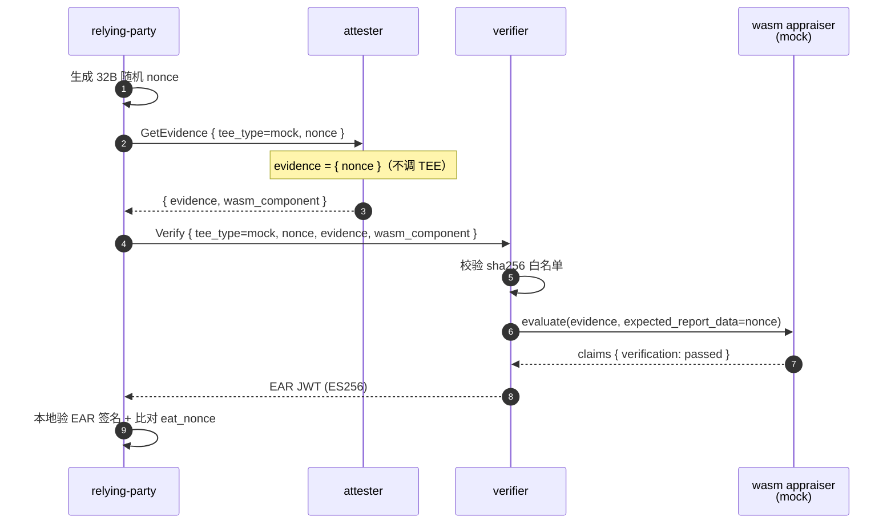
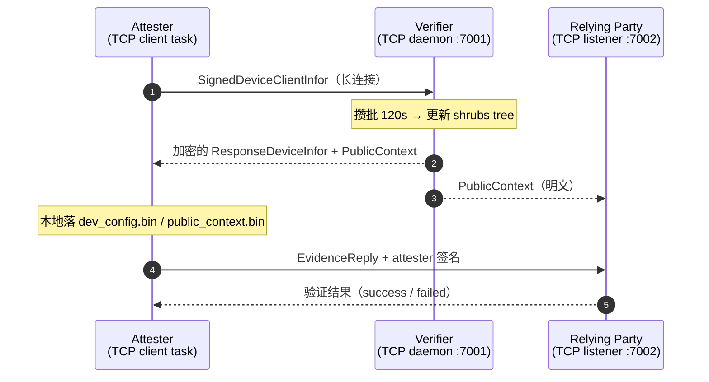
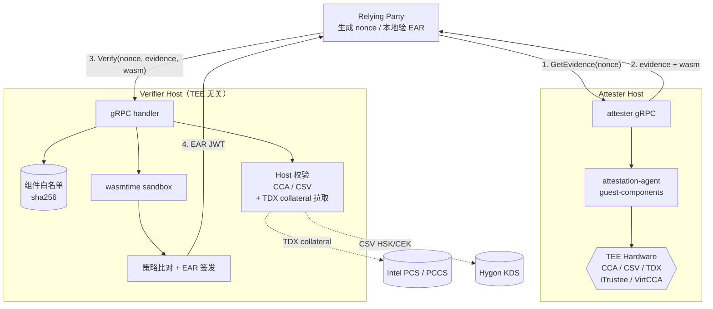
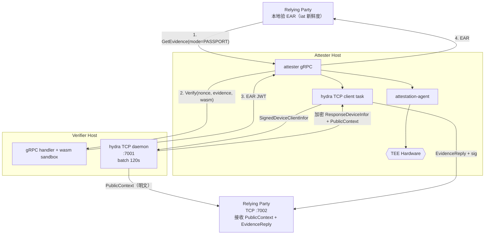

# unified-attestation

> 基于 wasm 校验组件 + Groth16 零知识证明的可自证明远程证明实现，验证方与 TEE 平台解耦。

unified-attestation 解决远程证明中 “验证方必须为每种 TEE 内嵌平台特有代码” 的耦合问题。TEE 相关的证据校验被封装为 wasm 组件，由证明方随证据一并上传；验证方只做 sha256 白名单校验、wasmtime 沙箱调用、策略比对与 EAR 签发。TEE 平台升级只需替换组件与更新白名单，无需重发布验证方二进制。

支持六种 TEE 路径：mock / CCA / CSV / TDX / iTrustee / VirtCCA，以及五种叠加 hydra 零知识证明的 hydra 路径（cca-hydra / csv-hydra / tdx-hydra / itrustee-hydra / virtcca-hydra），合计 11 种 tee_type。hydra 层在不暴露具体位置的前提下证明设备属于白名单。

## 目录

- [背景](#背景)
- [安装](#安装)
- [使用](#使用)
  - [Mock 模式（无 TEE 依赖）](#mock-模式无-tee-依赖)
  - [TEE 路径](#tee-路径)
  - [Hydra 路径](#hydra-路径)
- [API](#api)
- [架构](#架构)
- [目录结构](#目录结构)

## 背景

四条核心机制（详见 [docs/zh/design.md](docs/zh/design.md)）：

- **验证方与 TEE 解耦**：每种 TEE 的证据校验封装到 wasm 组件，平台升级只替换组件 + 更新 sha256 白名单
- **挑战与证据密码学绑定**：nonce 直接进入 Groth16 公开输入或 TEE report_data，证据与 nonce 不可分割，重放窗口为零
- **零知识设备身份证明**：Shrubs 累加器 + Merkle path 证明设备在白名单内，不暴露具体位置
- **三条独立信任根**：组件白名单 + nonce 绑定 + 可信 root 列表，三层互不依赖
- **EAR 自封闭**：EAR 是 ES256 JWT，任何持有验证方公钥的第三方均可独立校验

## 安装

依赖：

- Rust 1.90.0（见 `rust-toolchain.toml`）
- `cargo install cargo-component --locked`（构建 wasm appraisers 所需）
- `rustup target add wasm32-wasip1`
- `openssl`（生成 ES256 密钥对）
- CCA / CSV / TDX / iTrustee / VirtCCA 证据采集依赖 [guest-components](https://github.com/SmartTree-zq1997/guest-components)（`attestation-agent` + `api-server-rest`）

构建：

```bash
# 1. 生成 EAR 签名密钥对到 config/keys/
bash scripts/gen-keys.sh

# 2. 构建全部 wasm appraisers
bash scripts/build-appraisers.sh

# 3. 构建 host 二进制
cargo build --release -p verifier -p attester -p relying-party
```

`config/keys/` 由脚本生成，已加入 gitignore。

## 使用

### Mock 模式（无 TEE 依赖）

单机端到端冒烟——verifier / attester / relying-party 全流程本地跑通：

```bash
./scripts/run-mvp.sh
```

Mock 路径不做真实硬件校验，仅测 host ↔ wasm 管道。



上图是 background-check 流程；passport 模式（`--mode passport`）由 attester 生成 nonce 并内部调用 verifier，RP 直接收到 EAR。见 [docs/zh/operations.md](docs/zh/operations.md)。

### TEE 路径

各 TEE 的端到端步骤依赖对应硬件，命令与配置见分路径文档：

| 路径 | 文档 | 硬件 / 依赖 |
| ---- | ---- | ---------- |
| CCA | [docs/zh/cca.md](docs/zh/cca.md) | ARM CCA + guest-components |
| CSV | [docs/zh/csv.md](docs/zh/csv.md) | Hygon CSV + AA + HSK/CEK 缓存或 KDS |
| TDX | [docs/zh/tdx.md](docs/zh/tdx.md) | Intel TDX + AA + PCS / PCCS 可达 |
| iTrustee | [docs/zh/itrustee.md](docs/zh/itrustee.md) | iTrustee TEE + libteeverifier.so |
| VirtCCA | [docs/zh/virtcca.md](docs/zh/virtcca.md) | VirtCCA TEE + libvccaattestation.so |

Passport 模式下 tee_type = `<path>-hydra` 时启用 hydra 叠加，具体细节见下节。

### Hydra 路径

Hydra 采用与 gRPC 并列的长连接 TCP 通道，独立于 wasm 证据校验。三方均需常驻并保持连接；verifier 攒批 120 秒后统一更新 shrubs tree 并推送 PublicContext（含最新 root + 验证方公钥）到 attester 和 relying-party。



hydra 流可以一键跑，也可以拆两步：

```bash
# 步骤 1：常驻，负责 hydra 会话 bootstrap（自动生成 session 目录 + dev_config.bin + public_context.bin）
attester --config config/attester.toml

# 步骤 2：从最近 session 生成 EvidenceReply 并发送
attester --config config/attester.toml hydra-evidence --rp 127.0.0.1:7002

# 指定 session 目录
attester --config config/attester.toml hydra-evidence \
    --session workspace-data/attester/attester-runs/attester-xxx \
    --rp 127.0.0.1:7002

# 省略 --rp 时从 [hydra] relying_party_addrs 读取
```

关闭 hydra 只需在 attester config 中不配置 `[hydra]` 段，在 verifier config 中让 `[hydra] relying_party_addrs = []` 空即可停止 PublicContext 推送。

详见 [docs/zh/hydra.md](docs/zh/hydra.md)。

## API

### gRPC 服务

| Service | Method | 调用方 | 描述 |
| ------- | ------ | ----- | --- |
| `AttesterService` | `GetEvidence` | RP → attester | 推 nonce，收 evidence（passport 下直接收 EAR） |
| `VerifierService` | `Verify` | RP / attester → verifier | 提交 evidence，收 EAR |

完整 message 定义在 `protos/attestation.proto`，调用流程与 EAR claims 见 [docs/zh/protocol.md](docs/zh/protocol.md)。

### Hydra TCP 通道

- verifier 监听 `[hydra].listen`（默认 `127.0.0.1:7001`）
- relying-party 监听 `--hydra-listen`（推荐 `127.0.0.1:7002`）
- attester 通过 `[hydra].verifier_addr` 建立到 verifier 的长连接

帧格式与消息类型见 [docs/zh/hydra.md](docs/zh/hydra.md)。

### 配置

verifier / attester / relying-party 全部配置项见 [docs/zh/config.md](docs/zh/config.md)。

## 架构

### Background-check（非 hydra 路径）

RP 生成 nonce，分别调用 attester / verifier，最后本地验 EAR 并比对 eat_nonce：



### Passport（含 hydra 时启用长连接子通道）



## 目录结构

```
unified-attestation/
├── protos/                       gRPC 服务与消息（attestation.proto, tonic-build）
├── verifier/                     TEE 无关验证方 host（wasmtime 运行时 + CCA/CSV host 校验 + hydra TCP daemon）
├── attester/                     证据采集 + wasm 组件投递 + hydra TCP client task
├── relying-party/                RP 客户端 + EAR JWT 校验 + hydra TCP listener
├── hydra-toolkit/                共享 hydra 底层：Groth16 电路、shrubs 累加器、wire 编解码、AES-GCM 加密、TCP framing
├── appraisers/                   wasm 校验组件（cargo-component 构建）
│   ├── wit/verifier.wit          WIT 接口定义
│   ├── mock/                     骨架 appraiser
│   ├── cca/ + cca-hydra/         ARM CCA（host 校验）
│   ├── csv/ + csv-hydra/         Hygon CSV（host 校验）
│   ├── tdx/ + tdx-hydra/         Intel TDX（wasm 内完成全链校验）
│   ├── itrustee/ + itrustee-hydra/  iTrustee（host 抽取）
│   └── virtcca/ + virtcca-hydra/    VirtCCA（host 抽取）
├── config/                       配置模板
├── scripts/                      构建脚本与一键脚本
└── docs/                         细分文档（按 TEE / 主题）
    ├── en/                       英文文档
    └── zh/                       中文文档
```

`*-hydra` appraiser 与非 hydra 版本等价，仅 tee_type claim 不同；hydra 零知识证明的校验由 verifier 独立的 hydra TCP daemon 处理，与 wasm 无关。

文档索引：

| 主题 | 文档 |
| ---- | ---- |
| 设计原理 | [docs/zh/design.md](docs/zh/design.md) |
| 协议层（gRPC 服务、消息、EAR 格式、Hydra 帧） | [docs/zh/protocol.md](docs/zh/protocol.md) |
| 配置项参考 | [docs/zh/config.md](docs/zh/config.md) |
| 运维手册 | [docs/zh/operations.md](docs/zh/operations.md) |
| CCA / CCA + hydra | [docs/zh/cca.md](docs/zh/cca.md) |
| Hygon CSV / CSV + hydra | [docs/zh/csv.md](docs/zh/csv.md) |
| TDX / TDX + hydra | [docs/zh/tdx.md](docs/zh/tdx.md) |
| iTrustee / iTrustee + hydra | [docs/zh/itrustee.md](docs/zh/itrustee.md) |
| VirtCCA / VirtCCA + hydra | [docs/zh/virtcca.md](docs/zh/virtcca.md) |
| hydra 子模块（电路、shrubs、TCP 通道、两步式命令） | [docs/zh/hydra.md](docs/zh/hydra.md) |
