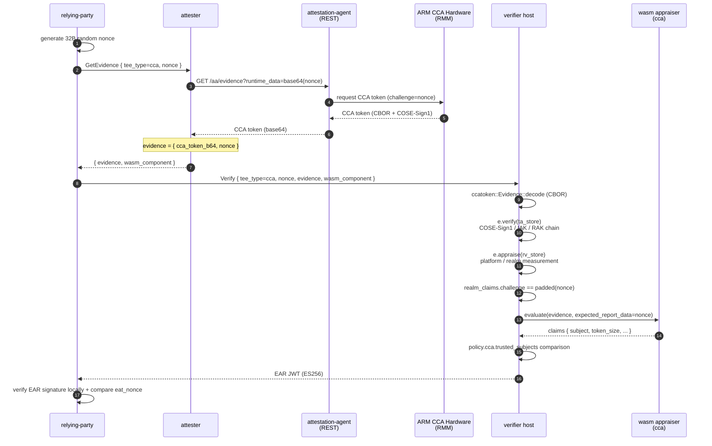

# CCA Path

ARM CCA remote attestation: hardware root signature + nonce binding. CCA real verification runs on the verifier host (consistent with trustmee-artifact), while the wasm appraiser only does field passthrough and application-level nonce comparison.

## Sequence Diagram



## Data Flow

```
RP:
  generate 32B random nonce
  GetEvidence(tee_type=cca, nonce) -> attester
  Verify(tee_type=cca, nonce, evidence, wasm_component) -> verifier

attester:
  AA REST GET /aa/evidence?runtime_data=<base64(nonce)> -> CCA token
  evidence = { cca_token_b64, nonce }

verifier host:
  ccatoken::Evidence::decode -> CBOR decode
  e.verify(&ta_store)         -> COSE-Sign1 / IAK / RAK chain
  e.appraise(&rv_store)       -> platform / realm measurement comparison
  realm_tvec.instance_identity == Affirming
  realm_claims.challenge == expected_report_data (nonce padded to 64 B)
  -> On success, extract CCA measurements and inject into evidence JSON:
     · cca_realm_initial_measurement  (RIM, hex)
     · cca_realm_personalization_value  (perso, hex)
     · cca_platform_instance_id  (hex)
     · cca_platform_implementation_id  (hex)
     · cca_platform_lifecycle  ("secured" / "secured_no_debug" / "recoverable" / "not_secured")
     · cca_platform_sw_components  (array)

wasm appraiser (cca):
  parse evidence JSON, verify nonce binding, passthrough host-injected fields to claims
  output: tee_type, verification, nonce_bound, token_size + 6 CCA measurement fields above
```

## Configuration

verifier-side `[policy.cca]`:

| key | description |
|---|---|
| `ta_store` | ccatoken trust anchor store JSON path, containing IAK public keys |
| `rv_store` | reference value store JSON path, containing platform/realm expected measurements |
| `trusted_subjects` | trusted realm subject whitelist (for cca-hydra) |
| `trusted_rim_hex` | trusted RIM list (hex). When non-empty, `cca_realm_initial_measurement` must match |

If `ta_store` / `rv_store` are missing, host-side verification is skipped (demo only). When `trusted_rim_hex` is empty, RIM comparison is skipped. In production, configure it to confirm the expected Realm image is running.

attester-side `aa_endpoint` points to guest-components `api-server-rest` (default `http://127.0.0.1:8006`).

## End-to-End Test

Requires ARM CCA hardware + guest-components attestation-agent + api-server-rest.

```bash
# 1. Generate ES256 key pair (first time)
bash scripts/gen-keys.sh

# 2. Build all wasm appraisers + host binaries
bash scripts/build-appraisers.sh
cargo build --release -p verifier -p attester -p relying-party

# 3. Start guest-components AA (prepare separately)
ttrpc-aa &
api-server-rest --features attestation &

# 4. Start verifier + attester
./target/release/verifier --config config/verifier-cca.toml > /tmp/verifier-cca.log 2>&1 &
./target/release/attester --config config/attester-cca.toml > /tmp/attester-cca.log 2>&1 &
sleep 2

# 5. RP triggers full flow
./target/release/relying-party \
    --attester http://127.0.0.1:9000 \
    --verifier http://127.0.0.1:8080 \
    --tee-type cca \
    --pubkey config/keys/ear_public.pem \
    --ear-out /tmp/ear-cca.jwt
```

## CCA + hydra Stacking

For `tee_type = cca-hydra`, the wasm evidence flow over gRPC is identical to CCA-only; the only difference is the emitted `tee_type` claim is `cca-hydra`.

Device-identity zero-knowledge proof runs on an independent Hydra TCP channel with a 120s batch window in the verifier and PublicContext broadcast to attester and relying-party. See [hydra.md](hydra.md) for the full spec.

### End-to-end test (cca-hydra)

Add two things to the CCA-only steps: give verifier and attester a `[hydra]` section, keep all three peers running, then invoke `attester hydra-evidence` to ship the reply.

```bash
bash scripts/gen-keys.sh
bash scripts/build-appraisers.sh
cargo build --release -p verifier -p attester -p relying-party

ttrpc-aa &
api-server-rest --features attestation &

./target/release/verifier --config config/verifier-cca-hydra.toml > /tmp/verifier-cca-hydra.log 2>&1 &
./target/release/relying-party \
    --hydra-listen 127.0.0.1:7002 hydra-serve > /tmp/rp-hydra.log 2>&1 &
./target/release/attester --config config/attester-cca-hydra.toml > /tmp/attester-cca-hydra.log 2>&1 &
sleep 130

./target/release/attester --config config/attester-cca-hydra.toml \
    hydra-evidence --rp 127.0.0.1:7002
```

The hydra channel is independent of gRPC; the non-hydra `--tee-type cca` gRPC flow can still be exercised through the relying-party client alongside the hydra path.
