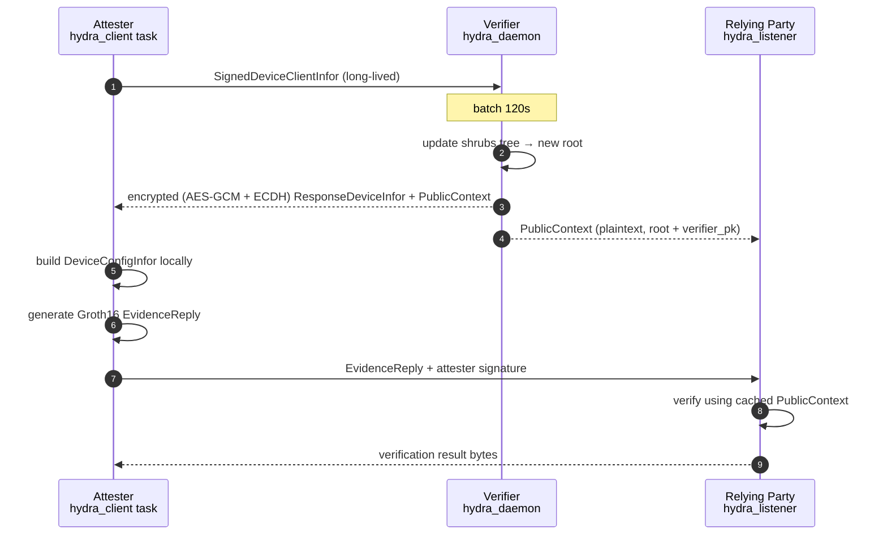

# hydra Submodule

Zero-knowledge device identity proof: Groth16 over BLS12-381 + Shrubs accumulator. Evidence proves "device is in the whitelist and the current nonce is bound to it" without revealing the position.

hydra runs on a **long-lived TCP channel independent of gRPC**: verifier / attester / relying-party stay connected; the verifier batches leaves for a fixed window, updates the shrubs tree, then publishes a `PublicContext` to all peers. The wasm appraiser does not participate in hydra verification — it only vouches for TEE evidence.

## Contents

- [Data flow](#data-flow)
- [Participants and ports](#participants-and-ports)
- [Message types](#message-types)
- [Shrubs batch](#shrubs-batch)
- [Two-step commands](#two-step-commands)
- [Persistence](#persistence)
- [`hydra-toolkit` layout](#hydra-toolkit-layout)

## Data flow



Old attesters whose path/tag changed receive another encrypted ResponseDeviceInfor on subsequent batches; those unaffected receive only a plaintext PublicContext refresh.

## Participants and ports

| Component | Role | Default port | Key parameters |
| --------- | ---- | ------------ | -------------- |
| verifier | TCP daemon, accepts attesters; pushes PublicContext to RP | 127.0.0.1:7001 | `[hydra] listen`, `[hydra] relying_party_addrs`, `[hydra] data_dir` |
| attester | Long-lived TCP client to verifier; short-lived TCP to RP for evidence | — | `[hydra] verifier_addr`, `[hydra] data_dir`, `[hydra] relying_party_addrs` |
| relying-party | TCP listener for PublicContext and EvidenceReply | 127.0.0.1:7002 | `--hydra-listen`, `--hydra-data-dir` |

Verifier / attester auto-generate secp256k1 keys on first start if missing:

```
workspace-data/verifier/verifier_key.bin
workspace-data/attester/attester_key.bin
```

The verifier_pk that appears in PublicContext is derived from `verifier_key.bin`.

## Message types

All TCP messages are framed as `[u64 length prefix][payload]`. The first 4 bytes of the payload act as a tag:

| Tag | Meaning | Direction |
| --- | ------- | --------- |
| `DEVI` (`MSG_DEVICE_INFOR`) | SignedDeviceClientInfor | attester → verifier |
| `PCTX` (`MSG_PUBLIC_CONTEXT`) | plaintext PublicContext refresh | verifier → attester / RP |
| `EVID` (`MSG_EVIDENCE`) | EvidenceReply + signature | attester → RP |
| (untagged ciphertext) | encrypted ResponseDeviceInfor + PublicContext, KEK derived via ECDH + HKDF against attester pubkey, AES-GCM sealed | verifier → attester |

Unknown tags trigger an `error: ...` byte-stream reply. Attesters treat `verification failed:` / `error:` prefixes as verifier rejection.

## Shrubs batch

- Verifier keeps `root: Vec<BlsScalar>`, `old_leaves: Vec<BlsScalar>`, `active: Vec<AttesterSession>` in memory
- Every incoming `DEVI` enqueues and (if not already running) starts a 120s timer
- On timer expiry the whole pending batch is inserted
  - First batch: `create_batch_devices` builds the shrubs tree from scratch
  - Later: `insert_batch_devices` inserts incrementally, `affected_indices` reports the affected old attesters
- After the update, `find_device_shrubs_path_tag` recomputes path/tag per affected attester
- Result:
  - **New attesters** and **affected old attesters**: encrypted reply (path/tag/sig + plaintext root/verifier_pk)
  - **Unaffected old attesters**: `PCTX` only
  - RP: broadcast `PCTX`

The batch length is hard-coded in `verifier/src/hydra_daemon.rs::BATCH_INTERVAL = 2 * 60s`; not exposed via config.

## Two-step commands

### One-shot (default)

```bash
attester --config config/attester.toml
```

On start the hydra_client task bootstraps a session; after the first encrypted reply it writes `dev_config.bin` and then loops on PublicContext updates. **It does NOT auto-ship EvidenceReply**.

### Two-step

Explicitly ship an EvidenceReply from the latest session:

```bash
# Step 1: run the daemon (same as above)
attester --config config/attester.toml

# Step 2: from another process, build+send one EvidenceReply
attester --config config/attester.toml hydra-evidence --rp 127.0.0.1:7002
```

- `--session <path>` picks an explicit session directory; if omitted, reads `[hydra] data_dir/attester_latest_session.txt`
- `--rp <addr>` can be repeated; overrides `[hydra] relying_party_addrs`

## Persistence

Verifier side:

```
workspace-data/verifier/
├── verifier_key.bin
└── verifier-responses/
    └── <attester_addr>.bin        # latest ResponseDeviceInfor per attester
```

Attester side:

```
workspace-data/attester/
├── attester_key.bin
├── attester_latest_session.txt    # pointer used by `hydra-evidence` when no --session
└── attester-runs/
    └── attester-<time>-<pid>-<counter>/
        ├── dev_infor.bin
        ├── dev_res.bin
        ├── dev_config.bin
        └── public_context.bin
```

Relying-party side:

```
workspace-data/relying-party/
└── public_context.bin             # latest PublicContext; re-loaded on restart
```

## `hydra-toolkit` layout

Single shared crate used by verifier / attester / relying-party:

| Module / file | Contents |
| ------------- | -------- |
| `lib.rs` | `KeyInfor`, `DeviceClientInfor`, `ResponseDeviceInfor`, `PublicContext`, `EvidenceReply`, wire codecs, AES-GCM encryption, `tcp_send_frame`/`tcp_read_frame` |
| `poseidon.rs` | Poseidon parameters + native hasher over BLS12-381 |
| `shurbstree.rs` | Shrubs accumulator (`create_batch_devices` / `insert_batch_devices` / `find_shrubs_path` / `affected_indices`) |

The Groth16 circuit and prove/verify entry points live in `attester/src/lib.rs` (prove) and `relying-party/src/lib.rs` (verify) respectively — they are only used at one endpoint each, so a shared crate is unnecessary.

## Public input ordering

`EvidenceReply::gen_public_inputs` yields the sequence used by both prover and verifier:

```
[ pk, root[0..N], authorized_infor, timestamp_secs, period_secs ]
```

- `pk` — Fr representation of the attester device pubkey
- `root` — shrubs root list from PublicContext
- `authorized_infor = H(H(H(pk, ar), time), period)`
- `timestamp` / `period` — verifier response Duration in seconds

## Known edge cases

- Shrubs boundary leaves: `find_shrubs_path` returns `None` when a leaf sits on a shrubs root boundary — those leaves are themselves the root of a sub-tree and have no path. Such attesters skip this batch and try again after the next update shifts their position.
- Losing `verifier_key.bin` invalidates every previously shipped EvidenceReply. Back it up.
