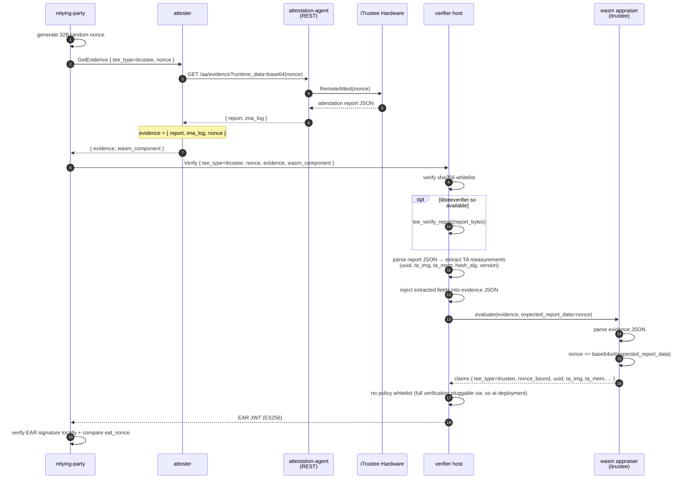

# iTrustee Path

iTrustee TEE remote attestation: hardware root signature + nonce binding. Real verification requires
libteeverifier.so FFI, which cannot be cross-compiled to wasm32-wasip1. The verifier host handles
evidence parsing (parsing the report JSON from attestation-agent) and injects extracted TA measurements
into the evidence; the wasm appraiser only performs field passthrough and nonce comparison, following
the same pattern as the [CCA path](cca.md).

## Sequence Diagram



## Data Flow

```
RP:
  generate 32B random nonce
  GetEvidence(tee_type=itrustee, nonce) -> attester
  Verify(tee_type=itrustee, nonce, evidence, wasm_component) -> verifier

attester:
  AA REST GET /aa/evidence?runtime_data=<base64(nonce)> -> report JSON
  evidence = { report, ima_log, nonce }

verifier host:
  parse report JSON → extract TA fields from payload sub-object:
    · uuid         (Trusted Application UUID)
    · ta_img       (TA image measurement, hex)
    · ta_mem       (TA memory measurement, hex)
    · hash_alg     (hash algorithm)
    · version      (TA version)
  inject into evidence JSON as:
    · itrustee_uuid
    · itrustee_ta_img
    · itrustee_ta_mem
    · itrustee_hash_alg
    · itrustee_version

wasm appraiser (itrustee):
  parse evidence JSON, verify nonce binding, passthrough host-injected fields to claims
  output: tee_type, verification, nonce_bound, uuid, ta_img, ta_mem, hash_alg, version
```

## Evidence Schema

The evidence built by the attester and passed to the verifier:

```json
{
  "report": "<JSON string from iTrustee SDK RemoteAttest return value>",
  "nonce": "<base64url nonce>",
  "ima_log": [<optional, IMA log byte array>]
}
```

After host-side parsing, the following fields are injected at the root level:

```json
{
  "itrustee_uuid": "<TA UUID>",
  "itrustee_ta_img": "<TA image measurement hex, optional>",
  "itrustee_ta_mem": "<TA memory measurement hex, optional>",
  "itrustee_hash_alg": "<hash algorithm, optional>",
  "itrustee_version": "<TA version, optional>"
}
```

## Configuration

The verifier currently has no iTrustee-specific policy section — full signature verification requires `libteeverifier.so` and is expected to be plugged in at deployment; the wasm appraiser only performs nonce binding and field passthrough.

attester-side: `aa_endpoint` points to guest-components `api-server-rest` (default `http://127.0.0.1:8006`).

Templates: `config/verifier-itrustee.toml` + `config/attester-itrustee.toml`.

## End-to-End Test

Requires iTrustee TEE hardware + guest-components attestation-agent + api-server-rest + libqca.so + libteeverifier.so.

```bash
# 1. Generate ES256 key pair (first time)
bash scripts/gen-keys.sh

# 2. Build all wasm appraisers + host binaries
bash scripts/build-appraisers.sh
cargo build --release -p verifier -p attester -p relying-party

# 3. Start guest-components AA (prepare separately)
ttrpc-aa &
api-server-rest --features attestation &

# 4. Start verifier + attester
./target/release/verifier --config config/verifier-itrustee.toml > /tmp/verifier-itrustee.log 2>&1 &
./target/release/attester --config config/attester-itrustee.toml > /tmp/attester-itrustee.log 2>&1 &
sleep 2

# 5. RP triggers full flow
./target/release/relying-party \
    --attester http://127.0.0.1:9000 \
    --verifier http://127.0.0.1:8080 \
    --tee-type itrustee \
    --pubkey config/keys/ear_public.pem \
    --ear-out /tmp/ear-itrustee.jwt
```

## Limitations

- Full verification requires libteeverifier.so FFI (deploy when available on the target platform)
- The verifier host currently only performs JSON parsing + field extraction; cryptographic signature verification via libteeverifier.so is not yet wired in
- No IMA log deep parsing (wasm appraiser only passes through IMA log size)
- itrustee-hydra stacking path: the gRPC layer is identical to itrustee-only; hydra runs on an independent TCP channel — see [hydra.md](hydra.md)
