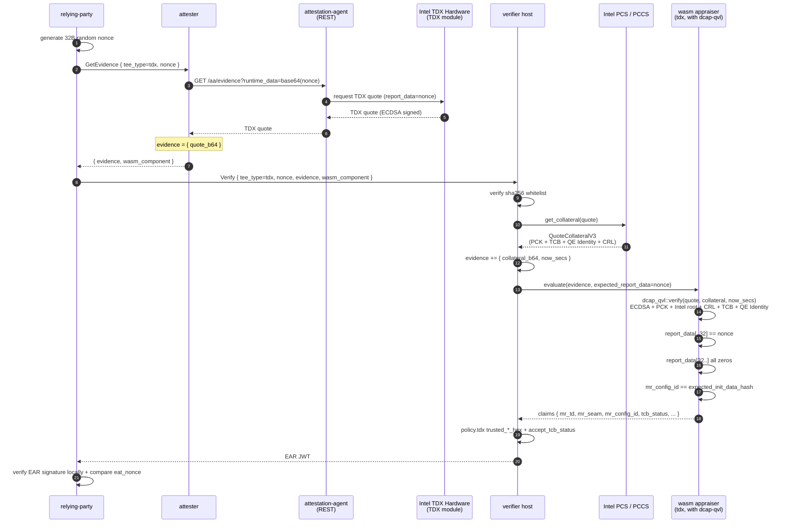

# TDX Path

Intel TDX remote attestation: dcap-qvl performs full ECDSA + PCK + Intel root + CRL + TCB info + QE Identity chain verification inside wasm. Collateral is fetched by the verifier host from PCS/PCCS by fmspc and injected into the evidence; the attester only sends the quote.

Unlike CCA, which places verification on the host (ccatoken cannot cross-compile to wasm32), the TDX path uses dcap-qvl + `rustcrypto` feature fully inside wasm. External root certificate fetching is centralized at the verifier, consistent with CSV and mainstream trustee implementations.

## Sequence Diagram



## Data Flow

```
RP:
  generate 32B random nonce
  GetEvidence(tee_type=tdx, nonce) -> attester
  Verify(tee_type=tdx, nonce, evidence, wasm_component) -> verifier

attester:
  AA REST GET /aa/evidence?runtime_data=<base64(nonce)> -> TDX quote
  evidence = { quote_b64 }

verifier host:
  extract quote_bytes from evidence
  dcap_qvl::collateral::get_collateral(pccs_url, &quote_bytes) -> collateral
  evidence += { collateral_b64, now_secs }
  -> feed to wasm appraiser

wasm appraiser (tdx):
  dcap_qvl::verify::rustcrypto::verify(&quote, &collateral, now_secs)
    -> chain verification + tcb_status + advisory_ids
  Quote::parse -> td_report
  td.report_data[..32] == expected_report_data (nonce)
  td.report_data[32..] must be all zeros
  td.mr_config_id == expected_init_data_hash (when passed through by host)
  fill claims: mr_td / mr_seam / mr_signer_seam / mr_config_id / report_data
              / tcb_status / advisory_ids

verifier host policy:
  compare against [policy.tdx] trusted_*_hex lists + accept_tcb_status
```

## Evidence Schema

attester → verifier:

```json
{ "quote_b64": "<base64(TDX quote bytes)>" }
```

verifier → wasm (after host injects collateral):

```json
{
  "quote_b64":      "<base64(TDX quote bytes)>",
  "collateral_b64": "<base64(serde_json::to_vec(QuoteCollateralV3))>",
  "now_secs":       1700000000
}
```

## Configuration

verifier-side `[policy.tdx]`:

| key | description |
|---|---|
| `pccs_url` | PCCS or Intel PCS URL, host-side fetches collateral by fmspc |
| `trusted_mr_td_hex` | Trusted mr_td list (48 bytes / 96 hex chars) |
| `trusted_mr_seam_hex` | Intel-signed SEAM module measurement |
| `trusted_mr_config_id_hex` | init_data_hash, passed to wasm as expected_init_data_hash |
| `accept_tcb_status` | e.g. `["UpToDate"]` or `["UpToDate", "SwHardeningNeeded"]` |

When all `trusted_*_hex` / `accept_tcb_status` are empty, only full chain verification + nonce binding is performed, without measurement comparison (demo).

attester-side only needs `aa_endpoint`: no longer depends on PCS/PCCS.

## Why Collateral is Fetched at Verifier

- **Attester egress convergence**: Edge attesters only need to face the verifier, no need to reach PCS/PCCS; lower firewall/deployment cost
- **Centralized caching**: Collateral is shared per fmspc dimension; a centrally deployed verifier naturally adds LRU caching. Per-attester caching would be O(hosts × fmspc)
- **Consistent with mainstream ecosystems (trustee / anolis-trustee)**: avoids introducing fragmented variants at the protocol layer

The tradeoff is that evidence is no longer self-contained; verifier recomputation requires network access. Security is identical — provided the Intel root CA is configured locally at verifier startup, not fetched from the network.

## End-to-End Test

Requires Intel TDX hardware + guest-components AA + verifier host able to reach `policy.tdx.pccs_url` (public PCS or internal PCCS).

```bash
bash scripts/gen-keys.sh
bash scripts/build-appraisers.sh
cargo build --release -p verifier -p attester -p relying-party

ttrpc-aa &
api-server-rest --features attestation &

./target/release/verifier --config config/verifier-tdx.toml > /tmp/verifier-tdx.log 2>&1 &
./target/release/attester --config config/attester-tdx.toml > /tmp/attester-tdx.log 2>&1 &
sleep 2

./target/release/relying-party \
    --attester http://127.0.0.1:9000 \
    --verifier http://127.0.0.1:8080 \
    --tee-type tdx \
    --pubkey config/keys/ear_public.pem \
    --ear-out /tmp/ear-tdx.jwt
```

## TDX + hydra Stacking

For `tee_type = tdx-hydra`, the wasm evidence flow over gRPC is identical to TDX-only; the emitted `tee_type` claim is `tdx-hydra`.

Device-identity zero-knowledge proof runs on an independent Hydra TCP channel: verifier / attester / relying-party stay connected; the verifier batches for 120s, updates the shrubs tree, and broadcasts a PublicContext. The attester builds the Groth16 EvidenceReply locally and ships it to the RP. See [hydra.md](hydra.md) for config, ports, message types, and two-step commands.

Templates: `config/verifier-tdx-hydra.toml` + `config/attester-tdx-hydra.toml` (both carry `[hydra]`).

### End-to-end test (tdx-hydra)

Add two things to the TDX-only steps: give verifier and attester a `[hydra]` section, keep all three peers running, then invoke `attester hydra-evidence` to ship the reply.

```bash
bash scripts/gen-keys.sh
bash scripts/build-appraisers.sh
cargo build --release -p verifier -p attester -p relying-party

ttrpc-aa &
api-server-rest --features attestation &

./target/release/verifier --config config/verifier-tdx-hydra.toml > /tmp/verifier-tdx-hydra.log 2>&1 &
./target/release/relying-party \
    --hydra-listen 127.0.0.1:7002 hydra-serve > /tmp/rp-hydra.log 2>&1 &
./target/release/attester --config config/attester-tdx-hydra.toml > /tmp/attester-tdx-hydra.log 2>&1 &
sleep 130

./target/release/attester --config config/attester-tdx-hydra.toml \
    hydra-evidence --rp 127.0.0.1:7002
```
