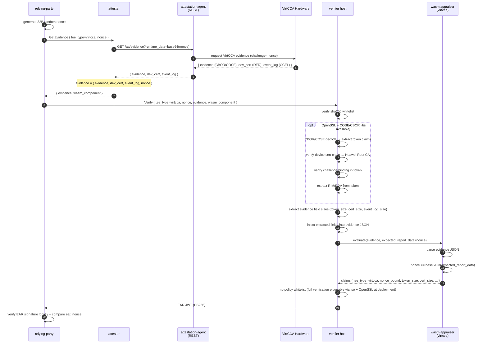

# VirtCCA Path

VirtCCA remote attestation: hardware root signature + nonce binding. Real verification requires OpenSSL + COSE/CBOR (CBOR/COSE token decoding + Huawei Root CA certificate chain), which cannot be cross-compiled to wasm32-wasip1. The verifier host handles evidence parsing (reading evidence binary sizes and metadata) and extracts measurements; the wasm appraiser only performs field passthrough and nonce comparison, following the same pattern as the [CCA path](cca.md).

## Sequence Diagram



## Data Flow

```
RP:
  generate 32B random nonce
  GetEvidence(tee_type=virtcca, nonce) -> attester
  Verify(tee_type=virtcca, nonce, evidence, wasm_component) -> verifier

attester:
  AA REST GET /aa/evidence?runtime_data=<base64(nonce)> -> { evidence, dev_cert, event_log }
  evidence = { evidence, dev_cert, event_log, nonce }

verifier host:
  parse evidence JSON → extract field sizes:
    · token_size      (CBOR/COSE evidence bytes length)
    · cert_size       (DER device certificate bytes length)
    · ima_log_size    (optional, IMA log bytes length)
    · event_log_size  (optional, CCEL event log bytes length)
  inject into evidence JSON as:
    · virtcca_token_size
    · virtcca_cert_size
    · virtcca_ima_log_size
    · virtcca_event_log_size

wasm appraiser (virtcca):
  parse evidence JSON, verify nonce binding, passthrough host-injected fields to claims
  output: tee_type, verification, nonce_bound, token_size, cert_size, ima_log_size, event_log_size
```

## Evidence Schema

The evidence built by the attester and passed to the verifier:

```json
{
  "evidence": [<CBOR/COSE token byte array>],
  "dev_cert": [<DER device certificate byte array>],
  "nonce": "<base64url nonce>",
  "ima_log": [<optional, IMA log byte array>],
  "event_log": [<optional, CCEL event log byte array>]
}
```

After host-side processing, the following fields are injected at the root level:

```json
{
  "virtcca_rim": "<RIM hex, extracted from token after CBOR decode>",
  "virtcca_rpv": "<RPV hex, extracted from token after CBOR decode>",
  "virtcca_challenge": "<challenge hex, from token>",
  "virtcca_is_platform": true,
  "virtcca_platform_sw_components": [...],
  "virtcca_token_size": 1234,
  "virtcca_cert_size": 567,
  "virtcca_ima_log_size": 890,
  "virtcca_event_log_size": 0
}
```

## Configuration

The verifier currently has no VirtCCA-specific policy section — full signature verification requires `libvccaattestation.so` + OpenSSL and is expected to be plugged in at deployment; the wasm appraiser only performs nonce binding and field passthrough.

attester-side: `aa_endpoint` points to guest-components `api-server-rest` (default `http://127.0.0.1:8006`).

Templates: `config/verifier-virtcca.toml` + `config/attester-virtcca.toml`.

## End-to-End Test

Requires VirtCCA TEE hardware + guest-components attestation-agent + api-server-rest + libvccaattestation.so + OpenSSL.

```bash
# 1. Generate ES256 key pair (first time)
bash scripts/gen-keys.sh

# 2. Build all wasm appraisers + host binaries
bash scripts/build-appraisers.sh
cargo build --release -p verifier -p attester -p relying-party

# 3. Start guest-components AA (prepare separately)
ttrpc-aa &
api-server-rest --features attestation &

# 4. Start verifier + attester
./target/release/verifier --config config/verifier-virtcca.toml > /tmp/verifier-virtcca.log 2>&1 &
./target/release/attester --config config/attester-virtcca.toml > /tmp/attester-virtcca.log 2>&1 &
sleep 2

# 5. RP triggers full flow
./target/release/relying-party \
    --attester http://127.0.0.1:9000 \
    --verifier http://127.0.0.1:8080 \
    --tee-type virtcca \
    --pubkey config/keys/ear_public.pem \
    --ear-out /tmp/ear-virtcca.jwt
```

## Limitations

- Full verification requires OpenSSL + cose + ciborium (CBOR/COSE token decoding + Huawei Root CA certificate chain). Deploy when available on the target platform.
- The verifier host currently only performs evidence field extraction (binary sizes); cryptographic certificate chain verification via OpenSSL is not yet wired in.
- No IMA log / event log deep parsing (wasm appraiser only passes through sizes).
- virtcca-hydra stacking path: the gRPC layer is identical to virtcca-only; hydra runs on an independent TCP channel — see [hydra.md](hydra.md)
