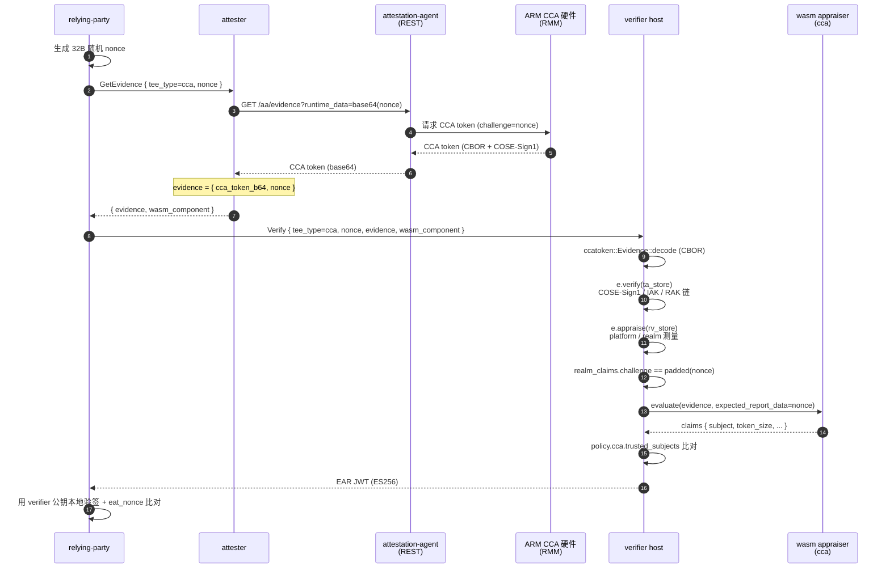

# CCA 路径

ARM CCA 远程证明：硬件根签名 + nonce 绑定。CCA 真验签放在 verifier host 端（与
trustmee-artifact 一致），wasm appraiser 仅做字段透传与业务级 nonce 比对。

## 时序图



## 数据流

```
RP:
  生成 32B 随机 nonce
  GetEvidence(tee_type=cca, nonce) -> attester
  Verify(tee_type=cca, nonce, evidence, wasm_component) -> verifier

attester:
  AA REST GET /aa/evidence?runtime_data=<base64(nonce)> -> CCA token
  evidence = { cca_token_b64, nonce }

verifier host:
  ccatoken::Evidence::decode -> CBOR 解码
  e.verify(&ta_store)         -> COSE-Sign1 / IAK / RAK 链
  e.appraise(&rv_store)       -> platform / realm 测量比对
  realm_tvec.instance_identity == Affirming
  realm_claims.challenge == expected_report_data（nonce padded 到 64 B）
  -> 通过后提取 CCA 度量值注入 evidence JSON：
     · cca_realm_initial_measurement  （RIM, hex）
     · cca_realm_personalization_value  （perso, hex）
     · cca_platform_instance_id  （hex）
     · cca_platform_implementation_id  （hex）
     · cca_platform_lifecycle  （"secured" / "secured_no_debug" / "recoverable" / "not_secured"）
     · cca_platform_sw_components  （数组）

wasm appraiser (cca):
  解 evidence JSON，校验 nonce 绑定，将 host 注入字段透传到 claims
  输出：tee_type, verification, nonce_bound, token_size + 以上 6 个 CCA 度量字段
```

## 配置

verifier 侧 `[policy.cca]`：

| key | 含义 |
|---|---|
| `ta_store` | ccatoken trust anchor store JSON 路径，含 IAK 公钥 |
| `rv_store` | reference value store JSON 路径，含 platform / realm 期望测量值 |
| `trusted_subjects` | 可信 realm 主体白名单（cca-hydra 用） |
| `trusted_rim_hex` | 可信 RIM 列表（hex），非空时 `cca_realm_initial_measurement` 必须命中 |

`ta_store` / `rv_store` 任一缺省 → host 端验签跳过，仅 demo 可用。
`trusted_rim_hex` 空时跳过 RIM 比对，生产建议配置以确认运行了预期 Realm 镜像。

attester 侧 `aa_endpoint` 指向 guest-components `api-server-rest`（默认
`http://127.0.0.1:8006`）。

## 端到端测试步骤

需要 ARM CCA 硬件 + guest-components attestation-agent + api-server-rest。

```bash
# 1. 生成 ES256 密钥对（首次）
bash scripts/gen-keys.sh

# 2. 编译所有 wasm appraiser + host 二进制
bash scripts/build-appraisers.sh
cargo build --release -p verifier -p attester -p relying-party

# 3. 启动 guest-components AA（自行准备）
ttrpc-aa &
api-server-rest --features attestation &

# 4. 启动 verifier + attester
./target/release/verifier --config config/verifier-cca.toml > /tmp/verifier-cca.log 2>&1 &
./target/release/attester --config config/attester-cca.toml > /tmp/attester-cca.log 2>&1 &
sleep 2

# 5. RP 触发完整流程
./target/release/relying-party \
    --attester http://127.0.0.1:9000 \
    --verifier http://127.0.0.1:8080 \
    --tee-type cca \
    --pubkey config/keys/ear_public.pem \
    --ear-out /tmp/ear-cca.jwt
```

## CCA + hydra 叠加

`tee_type = cca-hydra` 时，gRPC 层的 wasm 证据流程与 CCA-only 完全一致；只是 wasm 输出的 `tee_type` claim 变为 `cca-hydra`。

设备身份零知识证明走独立的 Hydra TCP 通道，与 wasm 无关：verifier / attester / relying-party 三方常驻长连接，verifier 攒批 120 秒后更新 shrubs tree 并广播 PublicContext。attester 拿到加密 ResponseDeviceInfor 后本地生成 Groth16 EvidenceReply，通过短连接 TCP 送到 RP 校验。

配置、端口、消息类型、两步式命令见 [hydra.md](hydra.md)。

### 端到端测试步骤（cca-hydra）

在 CCA-only 步骤基础上补两点：

- verifier 与 attester 的 config 里都加 `[hydra]` 段
- 三方常驻，`attester hydra-evidence --rp 127.0.0.1:7002` 触发投递

```bash
bash scripts/gen-keys.sh
bash scripts/build-appraisers.sh
cargo build --release -p verifier -p attester -p relying-party

ttrpc-aa &
api-server-rest --features attestation &

./target/release/verifier --config config/verifier-cca-hydra.toml > /tmp/verifier-cca-hydra.log 2>&1 &
./target/release/relying-party \
    --hydra-listen 127.0.0.1:7002 hydra-serve > /tmp/rp-hydra.log 2>&1 &
./target/release/attester --config config/attester-cca-hydra.toml > /tmp/attester-cca-hydra.log 2>&1 &
sleep 130   # 至少一个 batch 窗口

./target/release/attester --config config/attester-cca-hydra.toml \
    hydra-evidence --rp 127.0.0.1:7002
```

hydra 与 gRPC 相互独立，非 hydra 的 `--tee-type cca` gRPC 验证流也可以继续通过 relying-party 客户端在同一次运行中触发。

