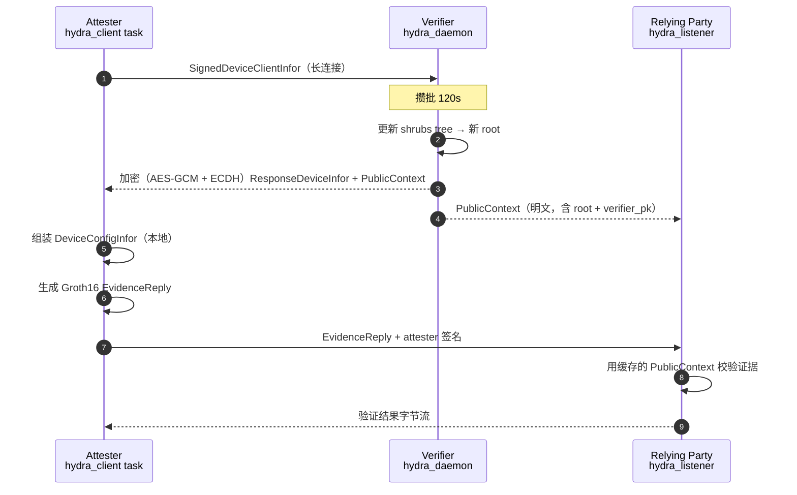

# hydra 子模块

hydra 提供零知识设备身份证明：Groth16 over BLS12-381 + Shrubs 累加器。证据只让人相信 “某设备在白名单里、且当前 nonce 与该证据绑定”，不暴露具体位置。

在本工程中 hydra 走一条**独立于 gRPC 的长连接 TCP 通道**：verifier / attester / relying-party 三方常驻，verifier 攒批更新 shrubs tree 后统一推送 PublicContext。wasm appraiser 不参与 hydra 校验，只做 TEE 证据核对。

## 目录

- [数据流](#数据流)
- [参与方与端口](#参与方与端口)
- [消息类型](#消息类型)
- [Shrubs batch](#shrubs-batch)
- [两步式命令](#两步式命令)
- [持久化](#持久化)
- [`hydra-toolkit` 结构](#hydra-toolkit-结构)

## 数据流



Path/tag 变化的老 attester 会再次收到加密 ResponseDeviceInfor；path/tag 不变的老 attester 只会收到明文 PublicContext 刷新。

## 参与方与端口

| 组件 | 角色 | 默认端口 | 关键参数 |
| ---- | ---- | -------- | -------- |
| verifier | TCP daemon，接受 attester；主动 publish 到 RP | 127.0.0.1:7001 | `[hydra] listen`、`[hydra] relying_party_addrs`、`[hydra] data_dir` |
| attester | TCP client 长连接 verifier；EvidenceReply 短连接推 RP | — | `[hydra] verifier_addr`、`[hydra] data_dir`、`[hydra] relying_party_addrs` |
| relying-party | TCP listener，接 PublicContext 与 EvidenceReply | 127.0.0.1:7002 | `--hydra-listen`、`--hydra-data-dir` |

verifier / relying-party 首次启动时若数据目录下没有密钥，会自动生成并落盘：

```
workspace-data/verifier/verifier_key.bin
workspace-data/attester/attester_key.bin
```

secp256k1 密钥；PublicContext 里带的 verifier_pk 由此密钥导出。

## 消息类型

所有 TCP 消息按 `[u64 长度前缀][负载]` 打帧，负载前 4 字节为消息类型 tag：

| Tag | 含义 | 方向 |
| --- | ---- | --- |
| `DEVI` (`MSG_DEVICE_INFOR`) | SignedDeviceClientInfor | attester → verifier |
| `PCTX` (`MSG_PUBLIC_CONTEXT`) | 明文 PublicContext 刷新 | verifier → attester / RP |
| `EVID` (`MSG_EVIDENCE`) | EvidenceReply + 签名 | attester → RP |
| （无 tag，直接密文） | 加密 ResponseDeviceInfor + PublicContext（AES-GCM + ECDH，用 attester 公钥派生 KEK） | verifier → attester |

RP 端遇到未知 tag 会以 `error: ...` 字节流回复；attester 端在等待 verifier 回信时，`verification failed: ...` / `error: ...` 前缀视为验证失败。

## Shrubs batch

- verifier 内存维护 `root: Vec<BlsScalar>`、`old_leaves: Vec<BlsScalar>`、`active: Vec<AttesterSession>`
- 每来一个 `DEVI` 会入队并（如未运行）启动 120 秒定时器
- 定时器到期时，把 pending 里全部 leaf 一次插入
  - 首批：`create_batch_devices` 从零构建 shrubs
  - 后续：`insert_batch_devices` 增量插入，`affected_indices` 计算受影响的旧 attester
- 更新完成后，`find_device_shrubs_path_tag` 为每个受影响 attester 重算 path/tag
- 结果：
  - **新 attester** 与 **受影响老 attester**：加密回信（含最新 path/tag/sig + 明文 root/verifier_pk）
  - **未受影响老 attester**：仅推 `PCTX`
  - RP：广播 `PCTX`

Batch 长度写死在 `verifier/src/hydra_daemon.rs::BATCH_INTERVAL = 2 * 60s`，需要更改在源码里改，配置层未开放。

## 两步式命令

### 一键式（默认）

```bash
attester --config config/attester.toml
```

启动后：hydra_client task 立即 bootstrap 一个 session，收到 verifier 首次加密回信后落 `dev_config.bin`，然后循环消费后续 PublicContext 更新。**默认不自动 ship EvidenceReply**。

### 两步式

一次性从最近 session 生成 EvidenceReply 并投递：

```bash
# 步骤 1：常驻 daemon（同上）
attester --config config/attester.toml

# 步骤 2：另一进程一次性生成 + 发送
attester --config config/attester.toml hydra-evidence --rp 127.0.0.1:7002
```

- `--session <path>` 显式指定 session 目录；不填则读取 `[hydra] data_dir/attester_latest_session.txt` 里最近一个
- `--rp <addr>` 允许多次传，覆盖 `[hydra] relying_party_addrs`

## 持久化

verifier 端：

```
workspace-data/verifier/
├── verifier_key.bin
└── verifier-responses/
    └── <attester_addr>.bin        # 每个 attester 最新 ResponseDeviceInfor
```

attester 端：

```
workspace-data/attester/
├── attester_key.bin
├── attester_latest_session.txt    # 指向最新 session
└── attester-runs/
    └── attester-<time>-<pid>-<counter>/
        ├── dev_infor.bin
        ├── dev_res.bin
        ├── dev_config.bin
        └── public_context.bin
```

relying-party 端：

```
workspace-data/relying-party/
└── public_context.bin             # verifier 推的最新 PublicContext（进程重启后自动加载）
```

## `hydra-toolkit` 结构

单一 crate，被 verifier / attester / relying-party 三方共享：

| 模块 / 文件 | 内容 |
| --------- | ---- |
| `lib.rs` | `KeyInfor`、`DeviceClientInfor`、`ResponseDeviceInfor`、`PublicContext`、`EvidenceReply`、Wire 编解码、AES-GCM 加密、`tcp_send_frame`/`tcp_read_frame` |
| `poseidon.rs` | BLS12-381 上的 Poseidon 参数与 native hasher |
| `shurbstree.rs` | Shrubs 累加器（`create_batch_devices` / `insert_batch_devices` / `find_shrubs_path` / `affected_indices`） |

Groth16 电路与 prove/verify 分别在 `attester/src/lib.rs`（prove）与 `relying-party/src/lib.rs`（verify），因为它们只被对应端点使用，没必要放到共享 crate 里。

## Public input 顺序

`EvidenceReply::gen_public_inputs` 生成的序列（attester 与 RP 双方按此顺序装填）：

```
[ pk, root[0..N], authorized_infor, timestamp_secs, period_secs ]
```

- `pk` — attester 设备公钥的 Fr 表示
- `root` — PublicContext 里的 shrubs root 列表
- `authorized_infor = H(H(H(pk, ar), time), period)`
- `timestamp` / `period` — verifier 响应时的 Duration，秒数进入公开输入

## 已知边界

- Shrubs 边界 leaf：`find_shrubs_path` 对落在 root 边界上的 leaf 返回 `None`——那些 leaf 本身就是一棵子树的 root，没有 path。这种 attester 会拿不到 shrubs_path/tag，本次 batch 直接跳过它。等下一次 batch 位置变化后再重算。
- verifier 密钥丢失即所有历史 EvidenceReply 变不可验证，请安全备份 `verifier_key.bin`。
