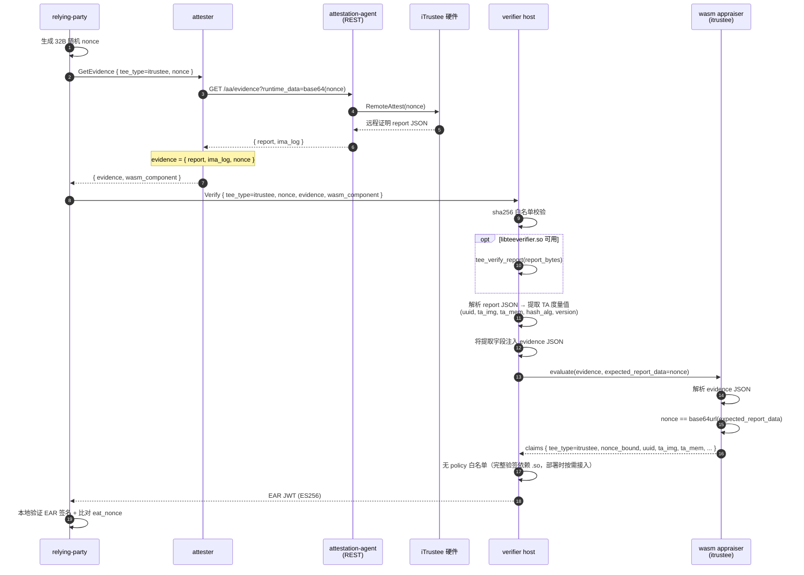

# iTrustee 路径

iTrustee TEE 远程证明：硬件根签名 + nonce 绑定。真实签名验证依赖 libteeverifier.so FFI，无法交叉编译到 wasm32-wasip1。verifier host 端负责解析 evidence（解析 attestation-agent 返回的 report JSON），提取 TA 度量值并注入 evidence；wasm appraiser 仅做字段透传和 nonce 比对，与 [CCA 路径](cca.md) 模式一致。

## 时序图



## 数据流

```
RP:
  生成 32B 随机 nonce
  GetEvidence(tee_type=itrustee, nonce) -> attester
  Verify(tee_type=itrustee, nonce, evidence, wasm_component) -> verifier

attester:
  AA REST GET /aa/evidence?runtime_data=<base64(nonce)> -> report JSON
  evidence = { report, ima_log, nonce }

verifier host:
  解析 report JSON → 从 payload 子对象提取 TA 字段：
    · uuid         （Trusted Application UUID）
    · ta_img       （TA image 度量值, hex）
    · ta_mem       （TA memory 度量值, hex）
    · hash_alg     （哈希算法）
    · version      （TA 版本）
  注入到 evidence JSON：
    · itrustee_uuid
    · itrustee_ta_img
    · itrustee_ta_mem
    · itrustee_hash_alg
    · itrustee_version

wasm appraiser (itrustee):
  解析 evidence JSON，校验 nonce 绑定，透传 host 注入字段到 claims
  输出：tee_type, verification, nonce_bound, uuid, ta_img, ta_mem, hash_alg, version
```

## Evidence Schema

attester 构建、传递给 verifier 的 evidence：

```json
{
  "report": "<iTrustee SDK RemoteAttest 返回值 JSON 字符串>",
  "nonce": "<base64url nonce>",
  "ima_log": [<可选，IMA 日志字节数组>]
}
```

host 端解析后，在 evidence JSON 根级注入以下字段：

```json
{
  "itrustee_uuid": "<TA UUID>",
  "itrustee_ta_img": "<TA image 度量值 hex，可选>",
  "itrustee_ta_mem": "<TA memory 度量值 hex，可选>",
  "itrustee_hash_alg": "<哈希算法，可选>",
  "itrustee_version": "<TA 版本，可选>"
}
```

## 配置

verifier 侧目前不含 iTrustee 专用 policy 段——完整验签依赖 `libteeverifier.so`，部署时按需集成；wasm appraiser 只做 nonce 绑定与字段透传。

attester 侧：`aa_endpoint` 指向 guest-components `api-server-rest`（默认 `http://127.0.0.1:8006`）。

模板：`config/verifier-itrustee.toml` + `config/attester-itrustee.toml`。

## 端到端测试

需要 iTrustee TEE 硬件 + guest-components attestation-agent + api-server-rest + libqca.so + libteeverifier.so。

```bash
# 1. 生成 ES256 密钥对（首次运行）
bash scripts/gen-keys.sh

# 2. 编译所有 wasm appraiser + host 二进制
bash scripts/build-appraisers.sh
cargo build --release -p verifier -p attester -p relying-party

# 3. 启动 guest-components AA（需提前部署）
ttrpc-aa &
api-server-rest --features attestation &

# 4. 启动 verifier + attester
./target/release/verifier --config config/verifier-itrustee.toml > /tmp/verifier-itrustee.log 2>&1 &
./target/release/attester --config config/attester-itrustee.toml > /tmp/attester-itrustee.log 2>&1 &
sleep 2

# 5. RP 触发完整流程
./target/release/relying-party \
    --attester http://127.0.0.1:9000 \
    --verifier http://127.0.0.1:8080 \
    --tee-type itrustee \
    --pubkey config/keys/ear_public.pem \
    --ear-out /tmp/ear-itrustee.jwt
```

## 限制

- 完整验签需 libteeverifier.so FFI（部署时在目标平台按需接入）
- verifier host 当前仅做 JSON 解析 + 字段提取；通过 libteeverifier.so 的密码学验签尚未接入
- IMA log 不做深度解析（wasm appraiser 仅透传大小）
- itrustee-hydra 叠加路径：gRPC 层与 itrustee-only 完全一致；hydra 走独立 TCP 通道，见 [hydra.md](hydra.md)
