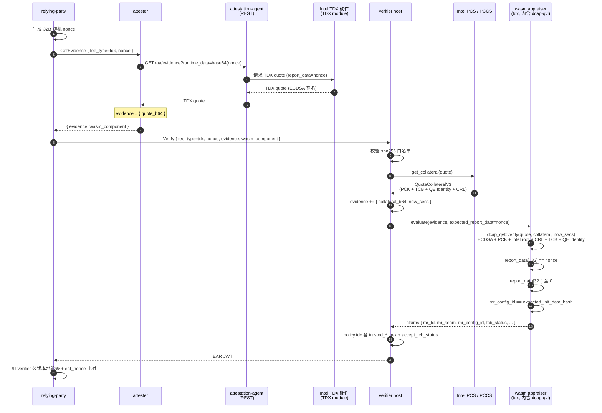

# TDX 路径

Intel TDX 远程证明：dcap-qvl 在 wasm 内做完整 ECDSA + PCK + Intel root + CRL
+ TCB info + QE Identity 链验签。collateral 由 verifier host 端按 fmspc
从 PCS / PCCS 拉取后注入 evidence，attester 仅负责送 quote。

与 CCA 不同处：CCA 把验签留在 host（ccatoken 不能跨 wasm32），TDX 路径走
dcap-qvl + `rustcrypto` feature 完整移到 wasm 内；外部根证书拉取统一收敛
到 verifier，与 CSV / 主流 trustee 实现一致。

## 时序图



## 数据流

```
RP:
  生成 32B 随机 nonce
  GetEvidence(tee_type=tdx, nonce) -> attester
  Verify(tee_type=tdx, nonce, evidence, wasm_component) -> verifier

attester:
  AA REST GET /aa/evidence?runtime_data=<base64(nonce)> -> TDX quote
  evidence = { quote_b64 }

verifier host:
  从 evidence 取 quote_bytes
  dcap_qvl::collateral::get_collateral(pccs_url, &quote_bytes) -> collateral
  evidence += { collateral_b64, now_secs }
  -> 喂给 wasm appraiser

wasm appraiser (tdx):
  dcap_qvl::verify::rustcrypto::verify(&quote, &collateral, now_secs)
    -> 链验签 + tcb_status + advisory_ids
  Quote::parse -> td_report
  td.report_data[..32] == expected_report_data（nonce）
  td.report_data[32..] 必须全 0
  td.mr_config_id == expected_init_data_hash（host 透传时）
  回填 claims：mr_td / mr_seam / mr_signer_seam / mr_config_id / report_data
              / tcb_status / advisory_ids

verifier host policy：
  对照 [policy.tdx] 中各 trusted_*_hex 列表 + accept_tcb_status
```

## Evidence schema

attester → verifier：

```json
{ "quote_b64": "<base64(TDX quote bytes)>" }
```

verifier → wasm（host 注入 collateral 后）：

```json
{
  "quote_b64":      "<base64(TDX quote bytes)>",
  "collateral_b64": "<base64(serde_json::to_vec(QuoteCollateralV3))>",
  "now_secs":       1700000000
}
```

## 配置

verifier 侧 `[policy.tdx]`：

| key | 含义 |
|---|---|
| `pccs_url` | PCCS 或 Intel PCS URL，host 端按 fmspc 拉 collateral 用 |
| `trusted_mr_td_hex` | 可信 mr_td 列表（48 字节 / 96 hex 字符） |
| `trusted_mr_seam_hex` | Intel 签名的 SEAM 模块测量 |
| `trusted_mr_config_id_hex` | init_data_hash，透传给 wasm 当 expected_init_data_hash |
| `accept_tcb_status` | 例如 `["UpToDate"]` 或 `["UpToDate", "SwHardeningNeeded"]` |

`trusted_*_hex` / `accept_tcb_status` 均空 → 只做完整链验签 + nonce 绑定，不做 measurement 比对（demo）。

attester 侧只需 `aa_endpoint`：不再依赖 PCS / PCCS。

## 为什么 collateral 在 verifier 拉

- **attester 出口收敛**：边缘 attester 只需面向 verifier，无需打通到 PCS / PCCS，防火墙 / 部署成本更低
- **集中缓存**：collateral 按 fmspc 维度共享，verifier 集中部署天然可加 LRU；attester 各自缓存只能 O(主机数 × fmspc)
- **与生态主流（trustee / anolis-trustee）一致**：避免在协议层引入碎片化变种

代价是 evidence 不再自包含，verifier 复算需触网。安全性无差异——前提是 Intel root CA 在
verifier 启动时本地配置，不从网络获取。

## 端到端测试步骤

需要 Intel TDX 硬件 + guest-components AA + verifier 主机能访问 `policy.tdx.pccs_url`（公网 PCS 或内网 PCCS）。

```bash
bash scripts/gen-keys.sh
bash scripts/build-appraisers.sh
cargo build --release -p verifier -p attester -p relying-party

ttrpc-aa &
api-server-rest --features attestation &

./target/release/verifier --config config/verifier-tdx.toml > /tmp/verifier-tdx.log 2>&1 &
./target/release/attester --config config/attester-tdx.toml > /tmp/attester-tdx.log 2>&1 &
sleep 2

./target/release/relying-party \
    --attester http://127.0.0.1:9000 \
    --verifier http://127.0.0.1:8080 \
    --tee-type tdx \
    --pubkey config/keys/ear_public.pem \
    --ear-out /tmp/ear-tdx.jwt
```

## TDX + hydra 叠加

`tee_type = tdx-hydra` 时，gRPC 层的 wasm 证据流程与 TDX-only 完全一致；wasm 输出 `tee_type = tdx-hydra`。

设备身份零知识证明走独立的 Hydra TCP 通道：verifier / attester / relying-party 三方常驻长连接，verifier 攒批 120 秒后更新 shrubs tree 并广播 PublicContext。attester 拿到加密 ResponseDeviceInfor 后本地生成 Groth16 EvidenceReply，通过短连接 TCP 送到 RP 校验。配置、端口、消息类型、两步式命令见 [hydra.md](hydra.md)。

模板：`config/verifier-tdx-hydra.toml` + `config/attester-tdx-hydra.toml`（含 `[hydra]` 段）。

### 端到端测试步骤（tdx-hydra）

在 TDX-only 步骤基础上补两点：verifier 与 attester config 加 `[hydra]` 段，三方常驻，然后 `attester hydra-evidence` 触发投递。

```bash
bash scripts/gen-keys.sh
bash scripts/build-appraisers.sh
cargo build --release -p verifier -p attester -p relying-party

ttrpc-aa &
api-server-rest --features attestation &

./target/release/verifier --config config/verifier-tdx-hydra.toml > /tmp/verifier-tdx-hydra.log 2>&1 &
./target/release/relying-party \
    --hydra-listen 127.0.0.1:7002 hydra-serve > /tmp/rp-hydra.log 2>&1 &
./target/release/attester --config config/attester-tdx-hydra.toml > /tmp/attester-tdx-hydra.log 2>&1 &
sleep 130

./target/release/attester --config config/attester-tdx-hydra.toml \
    hydra-evidence --rp 127.0.0.1:7002
```
