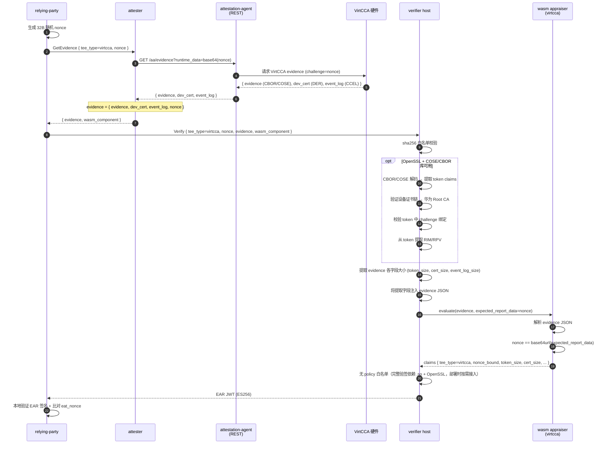

# VirtCCA 路径

VirtCCA 远程证明：硬件根签名 + nonce 绑定。真实签名验证依赖 OpenSSL + COSE/CBOR（CBOR/COSE token 解码 + 华为 Root CA 证书链），无法交叉编译到 wasm32-wasip1。verifier host 端负责 evidence 解析（读取 evidence 各字段的二进制大小和元数据）并提取度量值；wasm appraiser 仅做字段透传和 nonce 比对，与 [CCA 路径](cca.md) 模式一致。

## 时序图



## 数据流

```
RP:
  生成 32B 随机 nonce
  GetEvidence(tee_type=virtcca, nonce) -> attester
  Verify(tee_type=virtcca, nonce, evidence, wasm_component) -> verifier

attester:
  AA REST GET /aa/evidence?runtime_data=<base64(nonce)> -> { evidence, dev_cert, event_log }
  evidence = { evidence, dev_cert, event_log, nonce }

verifier host:
  解析 evidence JSON → 提取各字段大小：
    · token_size      （CBOR/COSE evidence 字节长度）
    · cert_size       （DER 设备证书字节长度）
    · ima_log_size    （可选，IMA 日志字节长度）
    · event_log_size  （可选，CCEL 事件日志字节长度）
  注入到 evidence JSON：
    · virtcca_token_size
    · virtcca_cert_size
    · virtcca_ima_log_size
    · virtcca_event_log_size

wasm appraiser (virtcca):
  解析 evidence JSON，校验 nonce 绑定，透传 host 注入字段到 claims
  输出：tee_type, verification, nonce_bound, token_size, cert_size, ima_log_size, event_log_size
```

## Evidence Schema

attester 构建、传递给 verifier 的 evidence：

```json
{
  "evidence": [<CBOR/COSE token 字节数组>],
  "dev_cert": [<DER 设备证书字节数组>],
  "nonce": "<base64url nonce>",
  "ima_log": [<可选，IMA 日志字节数组>],
  "event_log": [<可选，CCEL 事件日志字节数组>]
}
```

host 端处理后，在 evidence JSON 根级注入以下字段：

```json
{
  "virtcca_rim": "<RIM hex，从 CBOR 解码后的 token 中提取>",
  "virtcca_rpv": "<RPV hex，从 CBOR 解码后的 token 中提取>",
  "virtcca_challenge": "<challenge hex，从 token 中提取>",
  "virtcca_is_platform": true,
  "virtcca_platform_sw_components": [...],
  "virtcca_token_size": 1234,
  "virtcca_cert_size": 567,
  "virtcca_ima_log_size": 890,
  "virtcca_event_log_size": 0
}
```

## 配置

verifier 侧目前不含 VirtCCA 专用 policy 段——完整验签依赖 `libvccaattestation.so` + OpenSSL，部署时按需集成；wasm appraiser 只做 nonce 绑定与字段透传。

attester 侧：`aa_endpoint` 指向 guest-components `api-server-rest`（默认 `http://127.0.0.1:8006`）。

模板：`config/verifier-virtcca.toml` + `config/attester-virtcca.toml`。

## 端到端测试

需要 VirtCCA TEE 硬件 + guest-components attestation-agent + api-server-rest + libvccaattestation.so + OpenSSL。

```bash
# 1. 生成 ES256 密钥对（首次运行）
bash scripts/gen-keys.sh

# 2. 编译所有 wasm appraiser + host 二进制
bash scripts/build-appraisers.sh
cargo build --release -p verifier -p attester -p relying-party

# 3. 启动 guest-components AA（需提前部署）
ttrpc-aa &
api-server-rest --features attestation &

# 4. 启动 verifier + attester
./target/release/verifier --config config/verifier-virtcca.toml > /tmp/verifier-virtcca.log 2>&1 &
./target/release/attester --config config/attester-virtcca.toml > /tmp/attester-virtcca.log 2>&1 &
sleep 2

# 5. RP 触发完整流程
./target/release/relying-party \
    --attester http://127.0.0.1:9000 \
    --verifier http://127.0.0.1:8080 \
    --tee-type virtcca \
    --pubkey config/keys/ear_public.pem \
    --ear-out /tmp/ear-virtcca.jwt
```

## 限制

- 完整验签需 OpenSSL + cose + ciborium（CBOR/COSE token 解码 + 华为 Root CA 证书链验证），部署时在目标平台按需接入
- verifier host 当前仅做 evidence 字段提取（二进制大小）；通过 OpenSSL 的密码学证书链验证尚未接入
- IMA log / event log 不做深度解析（wasm appraiser 仅透传大小）
- virtcca-hydra 叠加路径：gRPC 层与 virtcca-only 完全一致；hydra 走独立 TCP 通道，见 [hydra.md](hydra.md)
